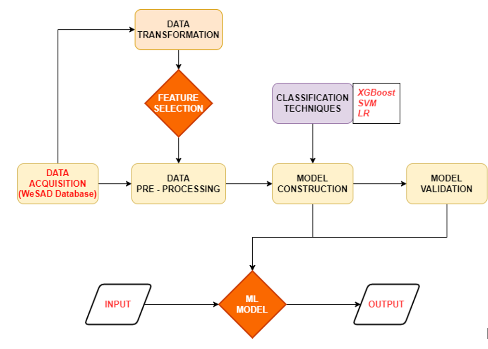
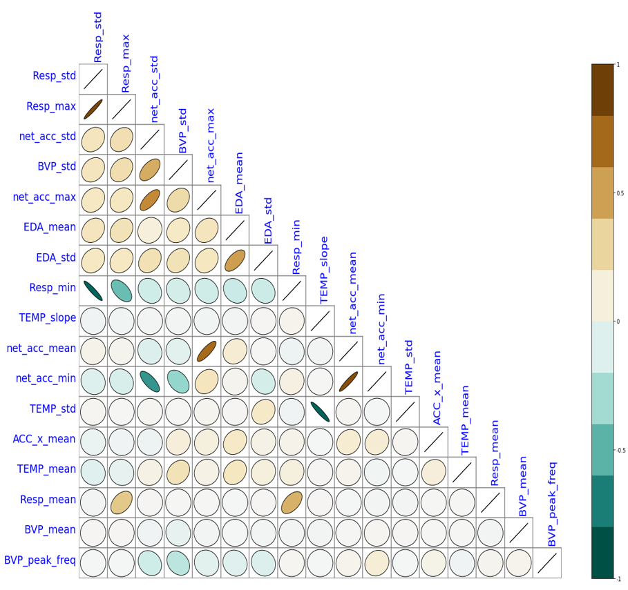
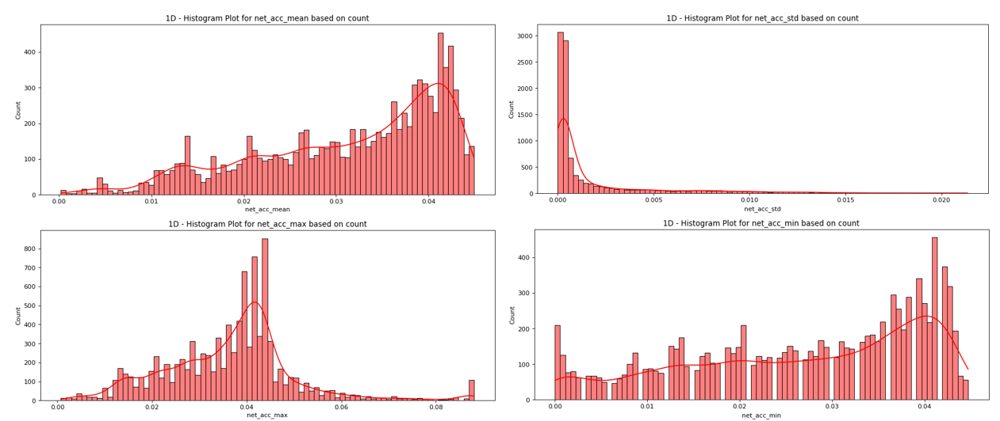
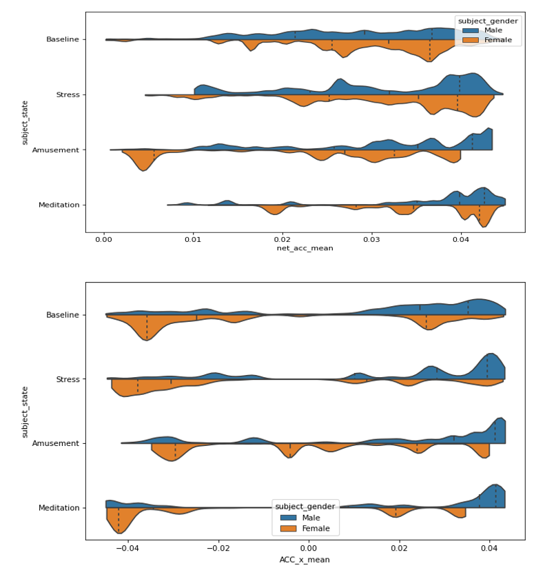
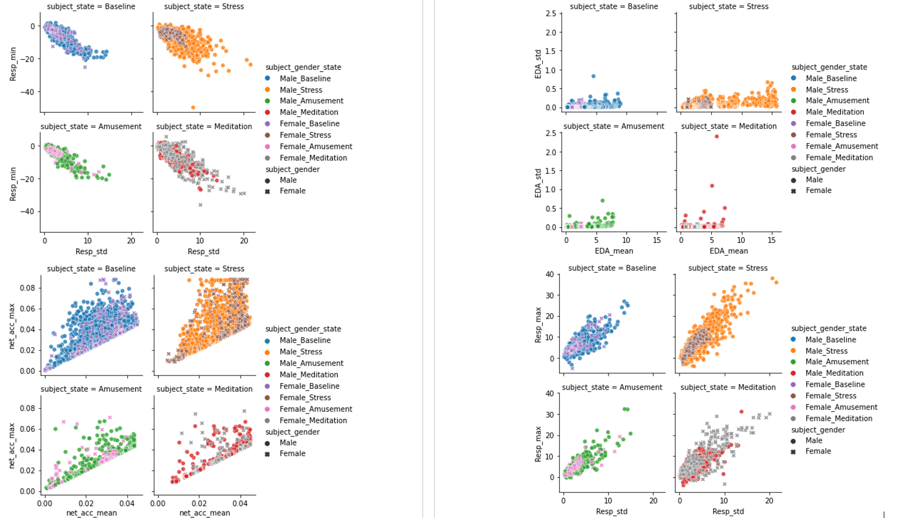
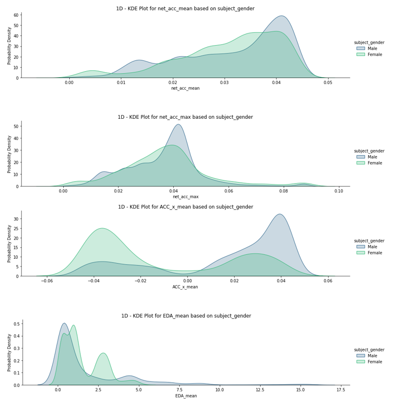
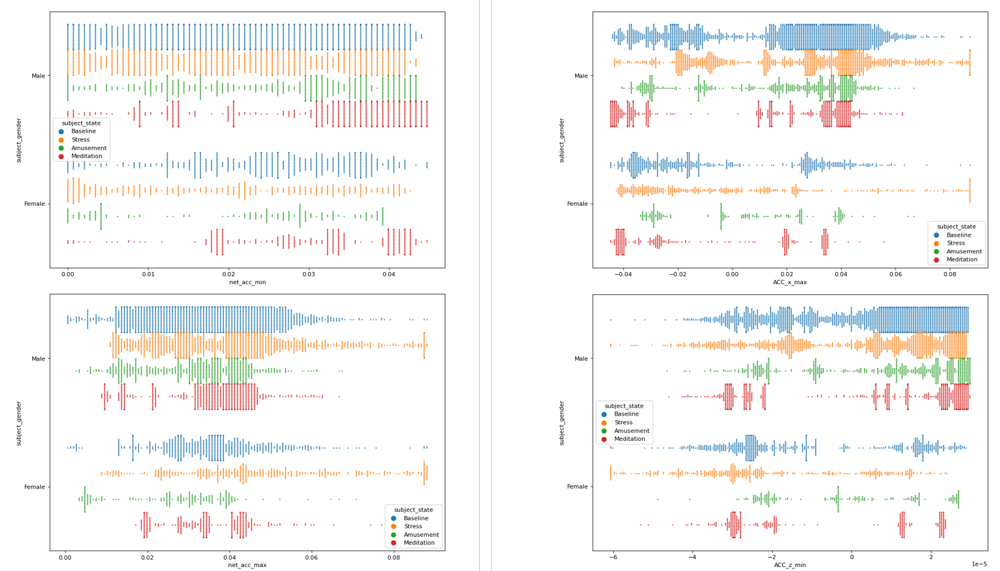
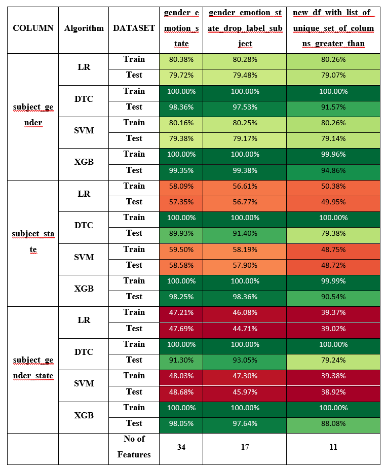
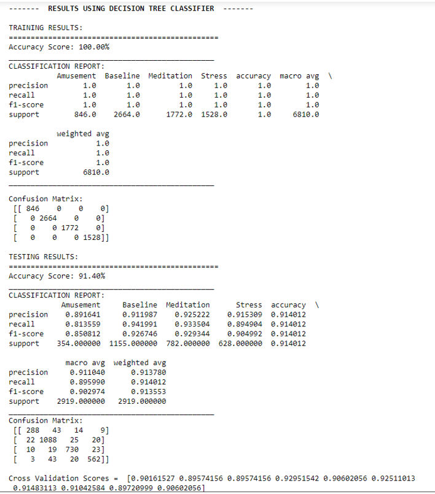
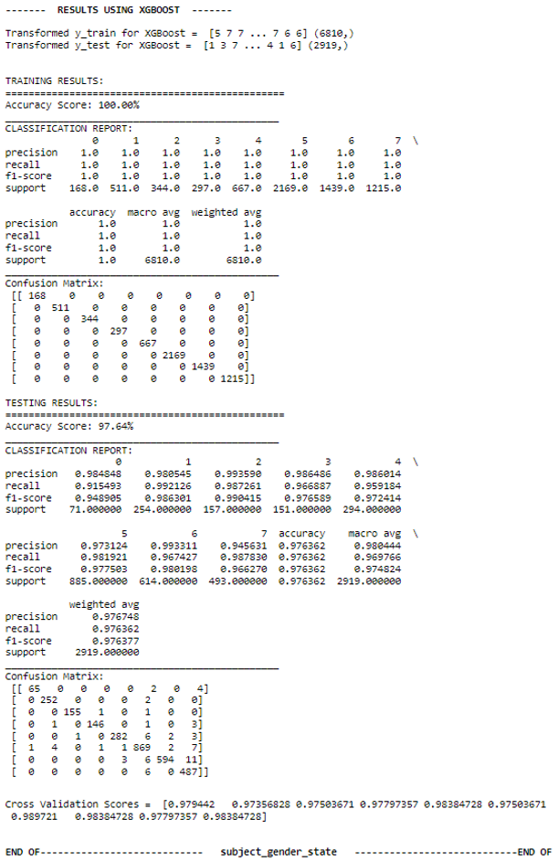

# AI-Enabled Self-monitoring and Automated Alert System based on Sensor Data for Safety of Women

Women Safety has become a serious concern in today’s modern world. Women (especially young girls) experience various forms of physical, emotional, psychological, sexual & financial abuses. As per the WHO report, 1 in 3 women world-wide have been subjected to some form of physical/ sexual violence. Such violence outrages the modesty of the woman & is considered as serious criminal offense which is punishable in the court of law.

Street Harassment is the most common type of crime. Many novel approaches have been devised, however, almost all of them rely on a manual trigger. Most often, considering the panic situation and the mental state of the Victim, it is not possible by her to act efficiently. Hence, we need a hands-free approach – an evaluation based on data from sensors. 
This project presents a Machine Learning approach to be
able to classify gender and emotional state of the victim and perpetrator based on the sensor data.
For gender based classification we use bi-classification scenario (Male and Female) and for Emotional state classification based on Labels we use 4 
emotional states - (Baseline, Meditation, Stress, Amusement).

Our approach differs due to the fact that we did not just focus on binary classes.
We feel humans are highly expressive and have wide range of emotional states. Hence, it is 
very improtant to consider as many emotional states as possible.

## Dataset

We use the WEarable Sensor and Affection Detection Dataset for the analysis on sensor generated values. The WESAD dataset contains accelerometer, heartrate, respiration, ECG, EDA, EMG readings of 15 participants (12 males and 3 female). Each of them has been recorded for 8 different states (0 = not defined / transient, 1 = baseline, 2 = stress, 3 = amusement, 4 = meditation, 5/6/7 = should be ignored in this dataset). Data was collected using the RespiBAN and Empatica E4 band. 
We believe, it is possible to segregate the emotional states of both the Victim (who is wearing the device) and device a complete solution as far as the sensor-based data analysis is concerned, for the protection of women under threat.

* Initially the dataset contained sensor readings for 17 subjects but due to sensor malfunction 2 were discarded.
* 2 sensors data readings (chest-word RespiBAN and wrist-worn Empatica E4).
* All samples for RespiBAN were sampled at 700 Hz.
* For Empatica E4 device; BVP, EDA, Body Temperature, 3 axis accelerometers were sampled at 64Hz, 4Hz, 4Hz and 32Hz respectively.
* 2 gender (Male and Female) and 4 emotion states classified (Baseline, Meditation, Stress, Amusement).

[Dataset Credits](https://ubicomp.eti.uni-siegen.de/home/datasets/icmi18/index.html?lang=en)

## Installation
Requirements:
* Python >= 3.8
* Jupyter Notebook

Create a 'Dataset' folder in the main repository and extract the data. 
We recommend using conda for python environment management and create a virtual environment.
Create your python environment and install dependencies:

    conda create -n wesad_analysis python=3.8 -y
    
Activate the environment by:

    conda activate wesad_analysis
    
You may download the requirements using the requirements.txt file by following this command:

    pip install -r requirements.txt

## Block Diagram

## EDA (Exploratory Data Analysis)

### (1) Correlation Plot
Following were the key pointers for plotting the correlation matrix:
* The threshold was set to 0.9. As a result, an output of range between -0.9 to 0.9 was obtained.
* A mask was applied to retrieve only the left lowermost pyramid since the upper pyramid is a carbon copy of the lower one.
* We have denoted the results in form of ellipse. By doing so, a lot of vital information can be obtained visually. For this purpose, we have used the ‘biokit.viz’ and ‘EllipseCollection’ from matplotlib collections.
* An ellipse facing left indicates correlation values between (-1, 0). In other words, it indicates negative values.
* Similarly, an ellipse facing right indicates correlation values between (0, 1). In other words, indicating positive values.
* It is worthwhile to note that, the size of the ellipse also plays a vital role. As the width decreases, it indicates correlation values tending towards extreme left (-1) or extreme right (1) depending on where the ellipse is facing. As the width increases and the ellipse becomes more circular, we understand those values are naturally inclined to 0.

_Correlogram of Gender Emotion State after Removing Highly Correlated Features > 0.9_

### (2) 1D - Histogram Plot
A few interesting pointers were observed on the dataset using 1D-Hist Plot:
* ‘Resp’ and ‘BVP’ showed beautiful bell curves and were either left-skewed, right-skewed or centred. This shows the uniformity of the data. The ‘BVP_peak_freq’ showed beautiful interference pattern like inference.
* ‘Temp slope’ did not show a lot of variation and were mostly centric to just a few bins.
* ‘ACC_x_mean’ and ‘net_acc_mean’ did not show uniformity in the data.

_1D - Histogram Plot for various features based on Count_

### (3) Violin plots for data distribution analysis
Violin plots show summary statistics as well as the density of each variable.
* A few of the parameters show clearly defined peaks. Others are either left or right skewed (suggesting that most of the data points lie there).
* Plots of ‘TEMP’ show a similar distribution and are suggestive of the fact that they could be dropped.
* ‘BVP_peak_freq’ show almost a continuous distribution of the male and female category in each emotion factor.

_Violin plots for data distribution analysis based on Hue_

### (4) Relative scatter plots for various emotional states
The relative scatter plot function gives you access to a variety of axes-level functions that display the relationship between two variables using semantic mappings of subsets. The underlying axes-level function is chosen using the "kind" parameter.
* The plots are created for those columns having correlation between absolute value (0.5, 0.9).
* 4 emotional states each for male and female are plotted for understanding the relationship.
* A few of the columns like ‘net_acc_std’ and ‘net_acc_max’ and 2D plots between RESP parameters show a linear relationship when plotted for various emotional states.
* Relationship between ‘TEMP_slope’ and ‘TEMP_std’ do not show clearly defined features that are widely spread.

_Relative scatter plots with Hue_

### (5) 1D – KDE Plots for various emotional states analysis
* Clearly defined peaks can be observed for a few columns ‘ACC_x_mean’, ‘EDA_mean’ and ‘TEMP_mean’.
* Others have intertwined peaks and a few of them have completely overlapping distributions.

_1D-KDE plots with Hue using subject_gender_

### (6) Swarmplots
Create a categorical scatterplot with non-overlapping points. This function is similar to stripplot(), but the points are adjusted so that they do not overlap (only along the categorical axis).

## Results and Performance Evaluation

For a better understanding on the extracted features, a result comparison of 3 extracted dataframes was done. These dataframes are:
*	gender_emotion_state having a total of 34 extracted features. This is the original extracted dataframe.
*	gender_emotion_state_drop_label_subject is an extract of the first one but without having the highly correlated features (threshold > absolute vale (0.9)) thus having a total of 17 features.
*	new_df_with_list_of_unique_set_of_columns_greater_than is further extracted from the second one. The obtained columns exclude all the less correlated features. Basically, this includes only those columns that have absolute correlation value in range between (0.5, 0.9). Total features – 11.

Following results were observed:
*	Binary classification between Male and Female yields the best results in all categories. Logistic Regression in this case yields the highest train and test accuracy (approx. 80%) among all the Logistic Regression results obtained.
*	Best test accuracy is obtained using DTC and XGB in the Binary scenario (98%).
*	Results also suggest that reducing the number of features obtained from 34 to 17 has in some cases given better results for the latter. Also, overall look on both of them suggests 17 columns are more than enough for obtaining better results.
*	Just like Logistic Regression, linear kernel SVM works better for binary classification (yields 79% accuracy). As the number of classifying features increase, there is a significant reduction in the accuracy giving just 46% on an average for 8 classes.
*	Cross validation results are very satisfactory as performing random splits of 10 yielded desirable difference in the accuracy.
*	In the overall category, XGBoost achieves the best results. Binary class average is 98%, 4 class (emotional state) average gives 95% and 8 class gender_emotion classification average yields 94% accuracy results.

_Comparative Result Analysis_

### For classification of Male and Female classes
_(a) Result for binary classification using Logistic Regression with Confusion Matrix (b) Result for binary classification using SVM with Confusion Matrix_

### For 4 class classification based on Emotional states
_Quad class classification report using Decision Tree Classifier with Confusion Matrix_

### For 8 class classification based on Gender Emotional states
_Octa classification report using XGBoost with Confusion Matrix_

