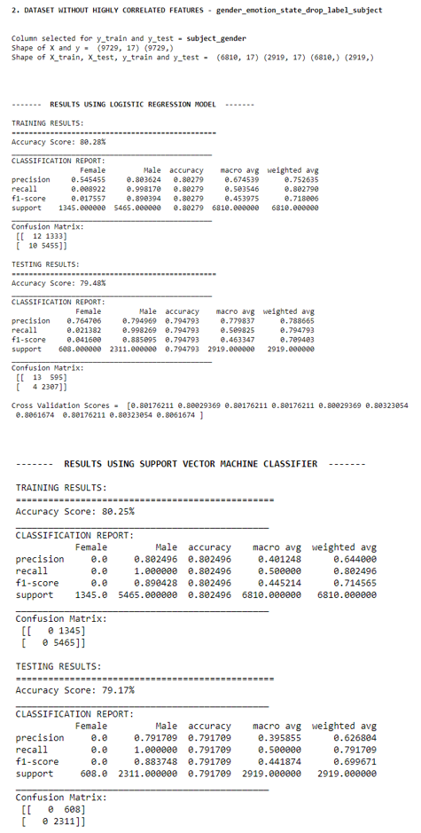

# AI-Enabled Self-monitoring and Automated Alert System based on Sensor Data for Safety of Women

Women Safety has become a serious concern in today’s modern world. Women (especially young girls) experience various forms of physical, emotional, psychological, sexual & financial abuses. As per the WHO report, 1 in 3 women world-wide have been subjected to some form of physical/ sexual violence. Such violence outrages the modesty of the woman & is considered as serious criminal offense which is punishable in the court of law.

Street Harassment is the most common type of crime. Many novel approaches have been devised, however, almost all of them rely on a manual trigger. Most often, considering the panic situation and the mental state of the Victim, it is not possible by her to act efficiently. Hence, we need a hands-free approach – an evaluation based on data from sensors. 
This project presents a Machine Learning approach to be
able to classify gender and emotional state of the victim and perpetrator based on the sensor data.
For gender based classification we use bi-classification scenario (Male and Female) and for Emotional state classification based on Labels we use 4 
emotional states - (Baseline, Meditation, Stress, Amusement).

Our approach differs due to the fact that we did not just focus on binary classes.
We feel humans are highly expressive and have wide range of emotional states. Hence, it is 
very improtant to consider as many emotional states as possible.

## Installation
Requirements:
* Python >= 3.8
* Jupyter Notebook

We recommend using conda for python environment management and create a virtual environment.
Create your python environment and install dependencies:

    conda create -n wesad_analysis python=3.8 -y
    
Activate the environment by:

    conda activate wesad_analysis
    
You may download the requirements using the requirements.txt file by following this command:

    pip install -r requirements.txt

## Dataset

We use the WEarable Sensor and Affection Detection Dataset for the analysis on sensor generated values. The WESAD dataset contains accelerometer, heartrate, respiration, ECG, EDA, EMG readings of 15 participants (12 males and 3 female). Each of them has been recorded for 8 different states (0 = not defined / transient, 1 = baseline, 2 = stress, 3 = amusement, 4 = meditation, 5/6/7 = should be ignored in this dataset). Data was collected using the RespiBAN and Empatica E4 band. 
We believe, it is possible to segregate the emotional states of both the Victim (who is wearing the device) and device a complete solution as far as the sensor-based data analysis is concerned, for the protection of women under threat.

* Initially the dataset contained sensor readings for 17 subjects but due to sensor malfunction 2 were discarded.
* 2 sensors data readings (chest-word RespiBAN and wrist-worn Empatica E4).
* All samples for RespiBAN were sampled at 700 Hz.
* For Empatica E4 device; BVP, EDA, Body Temperature, 3 axis accelerometers were sampled at 64Hz, 4Hz, 4Hz and 32Hz respectively.
* 2 gender (Male and Female) and 4 emotion states classified (Baseline, Meditation, Stress, Amusement).

[Dataset Credits](https://ubicomp.eti.uni-siegen.de/home/datasets/icmi18/index.html?lang=en)

## Block Diagram and Features List

## EDA (Exploratory Data Analysis)

_Analyzing the amplitude of the (a) Log – Amplitude spectrogram (b) Log – Frequency spectrogram of a speech signal. The darker regions mark the regions of high energy._

_Plot of Zero – crossing rate magnified from 9000 to 9050 for an audio sample._

_MFCCs values extracted using Librosa along with unique labels_

_(a) Boxplot for emotional intensity. (b) Violin plot showing the Quartiles and mean for each type of emotion. (c) Frames vs Mean Normalized MFCC values for two audio samples of anger emotion for each gender. The graph shows clear demarcation between the emotional states in both male and female categories._

    
_1D - KDE Plots for Gender Based Classification_

* Differentiating peaks can be observed using 1D – KDE plots for various acoustic features like SFM, Q25 …etc.
* For a few of the other measures like meanfreq, meandom, median …etc we can observe non – differentiating peaks suggesting that they would not be good for gender based classification task.

## Results and Performance Evaluation

### For classification of Male and Female voice
_Result of binary classification of Male and Female classification using (a) Decision Tree Classifier (b) XGBoost (Extreme Gradient Boost). The 0 indicates female class and 1 indicates the male class._

_(a) Result for classification of emotions using Support Vector Classifier (b) Emotion Classification result using XGBoost._

For a better understanding on the extracted features, a result comparison of 3 extracted dataframes was done. These dataframes are:
*	gender_emotion_state having a total of 34 extracted features. This is the original extracted dataframe.
*	gender_emotion_state_drop_label_subject is an extract of the first one but without having the highly correlated features (threshold > absolute vale (0.9)) thus having a total of 17 features.
*	new_df_with_list_of_unique_set_of_columns_greater_than is further extracted from the second one. The obtained columns exclude all the less correlated features. Basically, this includes only those columns that have absolute correlation value in range between (0.5, 0.9). Total features – 11.

Following results were observed:
*	Binary classification between Male and Female yields the best results in all categories. Logistic Regression in this case yields the highest train and test accuracy (approx. 80%) among all the Logistic Regression results obtained.
*	Best test accuracy is obtained using DTC and XGB in the Binary scenario (98%).
*	Results also suggest that reducing the number of features obtained from 34 to 17 has in some cases given better results for the latter. Also, overall look on both of them suggests 17 columns are more than enough for obtaining better results.
*	Just like Logistic Regression, linear kernel SVM works better for binary classification (yields 79% accuracy). As the number of classifying features increase, there is a significant reduction in the accuracy giving just 46% on an average for 8 classes.
*	Cross validation results are very satisfactory as performing random splits of 10 yielded desirable difference in the accuracy.
*	In the overall category, XGBoost achieves the best results. Binary class average is 98%, 4 class (emotional state) average gives 95% and 8 class gender_emotion classification average yields 94% accuracy results.

_Confusion Matrix_

